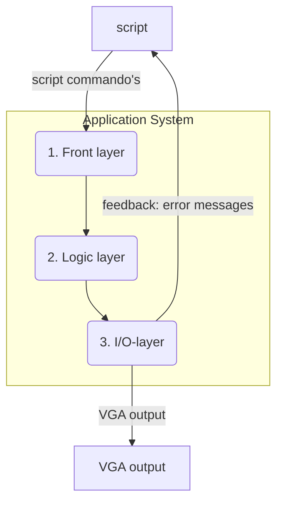

# High-Level Design: 3-Lagen Model

Hier is een high-level design voor de applicatie, gebaseerd op een 3-lagen architectuur.

## Architectuur Overzicht

De applicatie is verdeeld in drie lagen, visueel weergegeven als sectoren van een systeem, wat een geïntegreerde maar gelaagde structuur suggereert.

1.  **Front Layer:** Verantwoordelijk voor de gebruikersinteractie en het verwerken van binnenkomende commando's.
2.  **Logic Layer:** Bevat de kernlogica voor het tekenen en beheren van de grafische uitvoer.
3.  **I/O Layer:** Direct verantwoordelijk voor de hardware-aansturing, inclusief VGA-uitvoer en seriële communicatie.

Deze gelaagde aanpak zorgt voor een duidelijke scheiding van verantwoordelijkheden (Separation of Concerns), wat de software beter onderhoudbaar, testbaar en uitbreidbaar maakt.

## Layer Details

### 1. Front Layer

*   **Verantwoordelijkheden:**
    *   Ontvangt `script commando's` van de externe "script" bron (via de I/O Layer's USART Driver).
    *   Parseert de tekstuele commando's (bv. "LIJN,10,20,100,200,BLAUW").
    *   Valideert de commando's en hun parameters.
    *   Roept de juiste functies aan in de `Logic Layer` om de commando's uit te voeren.
*   **Componenten:**
    *   `command_parser.c` / `command_parser.h`

### 2. Logic Layer

*   **Verantwoordelijkheden:**
    *   Biedt een abstracte API voor tekenfunctionaliteit (bv. `VGA_drawLine()`, `VGA_drawText()`).
    *   Implementeert de algoritmes voor het tekenen van figuren (bv. Bresenham's line algorithm).
    *   Beheert de framebuffer: een geheugenbuffer die de kleur van elke pixel op het scherm bevat.
    *   Rendered lettertypes naar de framebuffer.
    *   Ontvangt aanroepen van de `Front Layer` en stuurt resultaten door naar de `I/O Layer`.
*   **Componenten:**
    *   `vga_drawing.c` / `vga_drawing.h`
    *   `vga_text.c` / `vga_text.h`
    *   `framebuffer.c` / `framebuffer.h`

### 3. I/O Layer

*   **Verantwoordelijkheden:**
    *   Initialiseert en configureert de hardware peripherals.
    *   **VGA:** Genereert de H-Sync en V-Sync signalen met timers (TIM) en stuurt de pixeldata naar de pinnen met DMA en GPIO, resulterend in de `VGA output`.
    *   **USART:** Configureert de seriële poort voor communicatie en biedt functies voor het verzenden en ontvangen van data.
    *   Stuurt `feedback: error messages` terug naar de externe "script" bron.
    *   Ontvangt aanroepen van de `Logic Layer` voor hardware-interactie.
*   **Componenten:**
    *   `stm32_ub_vga_screen.c` / `stm32_ub_vga_screen.h` (bestaande VGA driver)
    *   `usart_driver.c` / `usart_driver.h`

## Foutafhandeling en Feedback

Een robuust systeem geeft duidelijke feedback aan de gebruiker, vooral als er iets misgaat.

1.  **Commandovalidatie (Front Layer):**
    *   De `Command Parser` valideert elk binnenkomend commando en de bijbehorende parameters.
    *   **Syntaxfouten:** Als een commando niet wordt herkend (bv. "LIJN" i.p.v. "LIJN"), wordt een foutmelding zoals "ERROR: Unknown command" teruggestuurd.
    *   **Parameterfouten:** Als parameters ongeldig zijn (bv. een coördinaat buiten het scherm), wordt een foutmelding zoals "ERROR: Invalid parameter" teruggestuurd.

2.  **Feedbackmechanisme:**
    *   Na het verwerken van een commando stuurt het `Application System` (via de I/O Layer) een statusbericht terug.
    *   **Succes:** Bij een succesvolle uitvoering wordt "OK" teruggestuurd.
    *   **Fout:** Bij een fout wordt een specifieke foutmelding teruggestuurd.
    *   Deze feedback wordt via de `USART Driver` in de I/O Layer naar de terminal van de gebruiker gestuurd.

### Foutpropagatie door de Lagen

Het is niet alleen belangrijk om commando-fouten af te handelen, maar ook om fouten die dieper in het systeem optreden (in de Logic- of I/O-laag) correct te verwerken.

*   **Return Codes:** Functies in de `Logic Layer` en `I/O Layer` moeten statuscodes teruggeven (bv. `SUCCESS` of `ERROR_INVALID_PARAM`).
*   **Doorgeven van Fouten:** Als een functie in een lagere laag een fout detecteert, geeft deze een foutcode terug aan de aanroepende functie in de hogere laag.
*   **Centrale Afhandeling:** De `Front Layer` is uiteindelijk verantwoordelijk voor het interpreteren van deze foutcodes. Als het een onherstelbare fout is, kan de `Front Layer` besluiten om een specifieke foutmelding naar de gebruiker te sturen, die dan via de `I/O Layer` als `feedback: error messages` wordt teruggestuurd.

**Voorbeeld:**
1.  De `Front Layer` roept `VGA_drawLine(600, 800, ...)` aan in de `Logic Layer`.
2.  De `VGA_drawLine` functie (in de `Logic Layer`) controleert de coördinaten en ziet dat ze buiten het scherm vallen.
3.  `VGA_drawLine` stopt de uitvoering en geeft `ERROR_OUT_OF_BOUNDS` terug aan de `Front Layer`.
4.  De `Front Layer` vangt deze foutcode op en stuurt de melding "ERROR: Coordinates out of bounds" naar de gebruiker.
